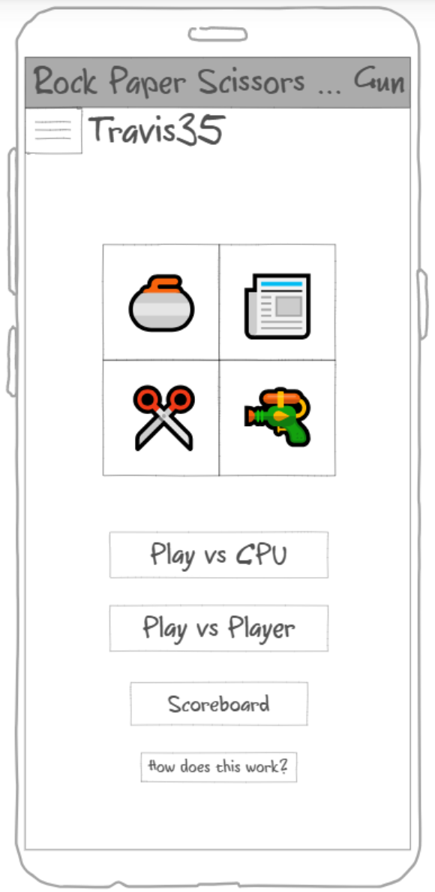
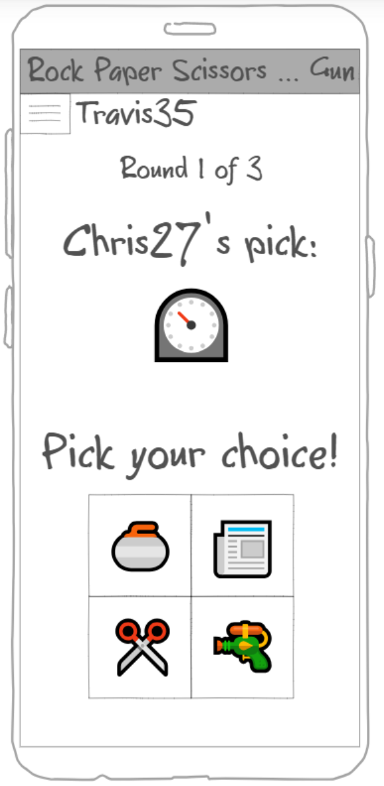
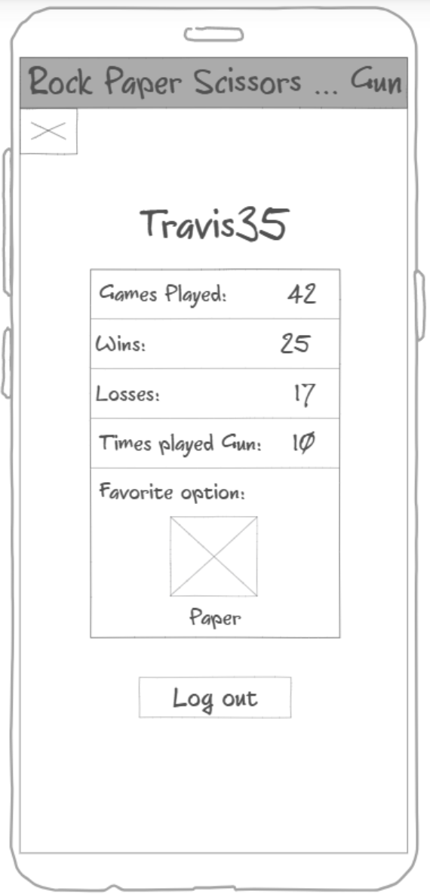
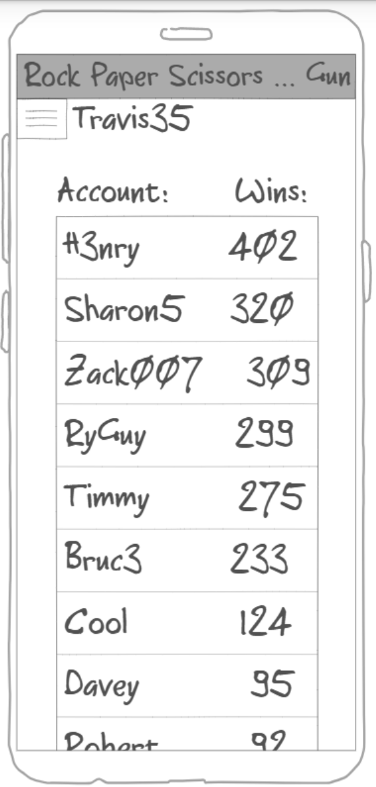

# Rock Paper Scissors Gun!
Click [here](/notes.md) to see my notes
## Description Deliverable:
### Elevator Pitch
Have you ever played Rock Paper Scissors? Have you ever wished it was even cooler? Now you can play the classic game with an added twist, a gun! The gun is beaten by the rock, but beats both paper and scissors. Play against a cpu or even your friends, and see how you stack up against others!

### Design
|  |  |  |  |
| - | - | - | - | 

### Key Features
- Easy account creation
- Keeps track of personal game stats
- Worldwide scoreboard displayed in real time
- Can play against website or other players
- Includes game explanation

### Technologies
- **HTML** - The 4 main webpages represented above will be written in HTML
- **CSS** - CSS will provide the styling and allow access on many types of devices
- **JavaScript** - The login, the game itself, and the storing of stats will be made with JavaScript
- **Authentication** - The user will create an account and login to play. User information will be securely stored in a backend database
- **Persistent data** - Used to store stats and scores, along with login information
- **Web sockets** - Stats and scores will update in real time

## HTML Deliverable:
For this deliverable I built my webpage structure in HTML.
- **Placeholder Application data** - Buttons placed to play the game, alongside text readouts of each player's pick
- **Placeholder Database data** - Scoreboard showing the user's stats and the world stats
- **WebSocket data:** - Sending and receiving the choices of each player in the game
- **3rd party service call** - placeholder for a profanity check on the input username
- I reorganized the pages a bit from the Description Deliverable, combining the account and scoreboard pages, and adding a separate login page
- A self-designed diagram of the way the game works was added to help understanding the way the game plays

## CSS Deliverable:
For this deliverable I styled and adjusted my web page with CSS.
- **Header, body, and footer** - All colored and justified. 
- **Navigation elements** - The header includes navigation to the other pages of the website, including the display of the logged in user, which upon click takes the user to the login screen
- **Responsive sizing** - The header and footer elements are fixed to the top and bottom of the page, while the center card adjusts according to the width of the window. The title also disappears if the window becomes too thin, allowing space for the menu and user.
- **Application elements** - Consistent coloring and style between elements (e.g. the buttons) brings the design of the site together.
- **Application text content** - The website has consistent fonts and text color.
- **Application images** - Images were used and styled to be button labels

## Java Deliverable:
For this deliverable I built the logic and functionality of my website
- **Future login** - The name is stored in local storage and used to keep track of scores
- **Future database data** - The javascript takes and displays data that will be taken from a database
- **Future WebSocket** - The cpu makes desicions for the opponent, but in the future the server will receive the choices of another player
- **Game Logic** - The game of Rock Paper Scissors Gun is completely playable
- Minor Adjustments - The timer was replaced with a points display, and a status message was added

## Service Deliverable:
For this deliverable I made my website a service, and added a 3rd party api
- **HTTP Service** - Using Node.js and Express the website is now a service
- **Frontend** - The frontend files are served up using Express static middleware
- **3rd party service** - My frontend files call a quote generator and displays it on the login screen
- **Backend Endpoints** - My backend has two endpoints that are called by the frontend
- Minor Adjustments - I wanted to call a 3rd party service that would check for profane usernames, but I couldn't get it to work correctly, so I switched to the quote generator

## Login Deliverable:
For this deliverable I added user creation and authentication, and global score storage.
- **New User registration** - Takes a new username and password and stores them in the database.
- **User authentication** - Validates the input username and password and logs in the user.
- **MongoDB application storage** - All user scores and stats are stored in MongoDB
- **MongoDB credential storage** - User credentials are stored in MongoDB
- **Authentication based functionality** - All unauthorized access to game and score pages are automatically re-routed to the login page